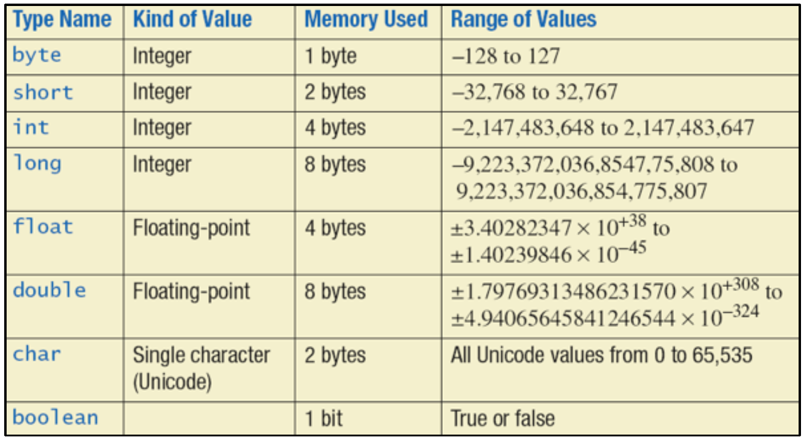
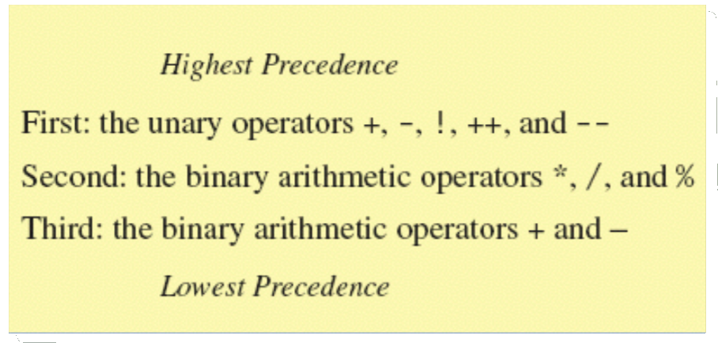
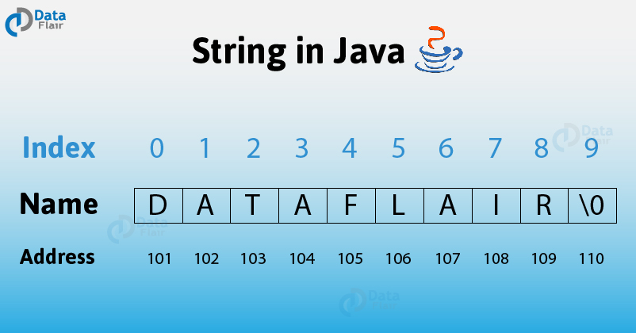
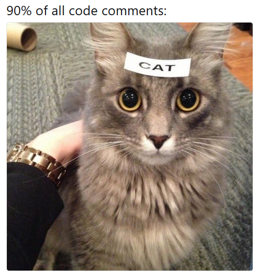
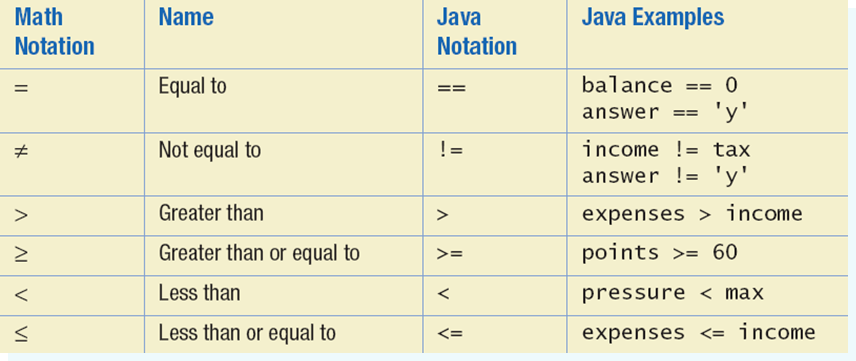
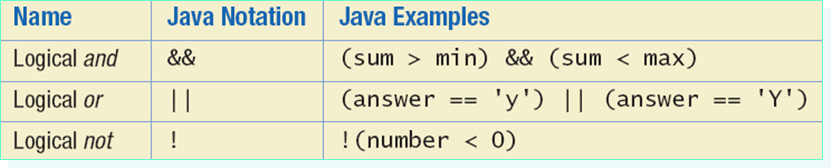
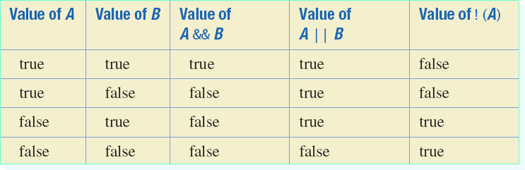

@snap[north span-100]
### Módulo 5
## Variables, Operadores e Instrucciones Básicas
@snapend

@snap[south-east span-30]

@snapend

@snap[south-west span-30]

@snapend

---
@snap[midpoint span-100 text-08]
# Identificadores
@snapend

+++
## Identificadores
@snap[span-100 text-09]
Un identificador es el nombre que se utiliza para referirnos una variable o método.

Las variables pueden contener:
@snapend

@snap[span-100]
@ul[text-08 text-blue](false)
* Letras (sin caracteres especiales)
* Números (0123456789)
* Guión bajo (_)
@ulend
@snapend

@snapend
@snap[span-100 text-09]
Sin embargo, no pueden:
@ul[text-09 text-blue](false)
* El primer caracter ser un número
* Contener puntos (.), asteriscos (*), u otros caracteres especiales (@!ñ%&).
* Ser una palabra clave o palabra reservada. [Ver lista](https://en.wikipedia.org/wiki/List_of_Java_keywords)
@ulend
@snapend

+++?code=assets/src/identifiers.java&lang=java
@[1, zoom-20](@fa[check-square text-green] Válido)
@[2, zoom-20](@fa[check-square text-green] Válido, combinar mayúsculas y minúsculas está permitido.)
@[3, zoom-20](@fa[check-square text-green] Válido, combinar caracteres y números está permitido.)
@[4, zoom-20](@fa[check-square text-green] Válido)
@[5, zoom-20](@fa[check-square text-green] Válido)
@[6, zoom-20](@fa[times-circle text-pink] Inválido! No podemos combinar letras y espacios.)
@[7, zoom-20](@fa[times-circle text-pink] Inválido! Los identificadores no pueden comenzar con un número.)
@[8, zoom-20](@fa[check-square text-green] Válido)
@[9, zoom-20](@fa[times-circle text-pink] Inválido! Los identificadores no pueden comenzar con caracteres especiales.)
@[10, zoom-20](@fa[times-circle text-pink] Inválido! Los identificadores no pueden comenzar con un número.)
@[11, zoom-20](@fa[times-circle text-pink] Inválido! Existen palabras reservadas que NO pueden ser utilizadas como nombres de variables.)
@[12, zoom-11](@fa[check-square text-green] Válido, es posible combinar mayúsculas y minúsculas. Los identificadores pueden ser arbitrareamente largas.)

--- 
@snap[midpoint span-100 text-08]
# Variables
@snapend

+++
## Variables
@snap[span-100]
Una _*variable*_ es la unión de un @css[text-blue](tipo de dato y un identificador) que nos permiten almacenar información. En Java, las variables son una ubicación de @css[text-blue](memoria RAM). 
<br><br>
Cuando la variable almacena cierta información, el dato se codifica en 1's y 0's y se almacena en memoria RAM.
@snapend

+++


+++
## Variables
@snap[span-100]
Una variable pasa por dos fases:
@snapend

@snap[span-100]
@ol[text-blue](false)
1. Declaración: @css[text-black](Especificamos un tipo de dato [int, char, String] )
2. Asignación: @css[text-black](Utilizamos el símbolo = para especificar un valor.)
@olend
@snapend
<br>
@snap[span-100 text-center]
Una variable SIEMPRE debe declararse antes de poderse usar. 
@snapend

+++
@snap[text-07 span-100]
## Tipos de datos primitivos

@snapend

+++
## Variables primitivas
@snap[span-100]
Las variables primitivas son los tipos de datos más básicos existentes en Java. Al combinar estos tipos de datos podemos representar cualquier estructura, juego, video, u objeto que nos imaginemos.
@snapend

@snap[span-100 south]

@snapend


+++?code=assets/src/variables.java&lang=java
@[1-2, zoom-15](Declaración de la variable "money_in_bank" de tipo "double".)
@[3-4, zoom-15](Almacenamos el valor "100.50" en la variable "money_in_bank".)

@[6-7, zoom-15](Declaración de la variable "myName" de tipo "String".)
@[8-9, zoom-15](Guardamos el texto "Arthur" en la variable "myName".)
@[8-11, zoom-15](Reemplazamos el contenido de "myName" con "Arthur Fleck".)

@[13-14, zoom-15](También es posible hacer una declaración y asignación en una misma instrucción.)

---
@snap[midpoint span-100 text-08]
# Operadores
@snapend

+++
@snap[text-08]
## Operadores Aritméticos
@snapend
@snap[span-100]
Podemos formar expresiones aritméticas mediante los operadores:
@snapend
@snap[span-100]
@ul[text-blue](false)
* + @css[text-black](Suma)
* - @css[text-black](Resta)
* * @css[text-black](Multiplicación)
* / @css[text-black](División)
* % @css[text-black](Módulo o residuo)
@ulend
@snapend

+++?code=assets/src/operations.java&lang=java
@snap[south span-100]
@[1-4, zoom-15](Declaraciones iniciales)
@[6-8, zoom-15](Multiplicamos "hoursWorked" y "payRate", almacenamos el resultado en "pay".)
@[1-8]()
@snapend

@snap[south-east span-100]
## Output!

@snapend

+++
## División
@snap[span-100 text-08]
@css[text-pink](IMPORTANTE!!!)
<br>
Cuando ambos operandos son de tipo `int`, el símbolo (@css[text-blue]( / )) indica una división entera. El resultado se trunca:
<br>
`9 / 2 = 4` 
<br>
`100 / 99 = 1`
<br><br>
@snapend
@snap[span-100 text-08]
Cuando por lo menos algun operando de la división es de tipo `double` o `float`, se hace división decimal. El resultado contará con una parte decimal:
<br>
`9 / 2.0 = 4.5` 
<br>
`100.0 / 99 = 1.0101010101010102` 
@snapend

+++
## Módulo
@snap[span-100 text-08]
El operador de @css[text-blue](módulo) (@css[text-blue](%)) calcula el residuo después de una división entera.
<br><br>
`9 % 2 = 1`
<br>
`17 % 3 = 2`
<br><br>
Este operador tiene muchos usos, por ejemplo @css[text-blue](verificar si un número es par o impar).
@snapend 

+++ 
@snap[span-100 text-08]
## Operadores Incrementales y Decrementales
Hay instrucciones especiales en Java que nos permiten incrementar el valor de una variable en 1. Estos se identifican mediante @css[text-blue](++) y @css[text-blue](--). Por ejemplo, asumiento que count es una variable numérica: 
@snapend
 
@snap[span-50 text-08 text-center]
<br>
`count++`<br>
`++count`<br>
`count--`<br>
`--count`<br>
@snapend

@snap[span-60 south-east text-center text-07 bg-orange]
@color[white](Cuando el operador está antes de la variable, se actualiza el contenido de la variable antes de evaluar la expresión.<br><br> Cuando el operador está después, se evalúa la expresión y después se actualiza la variable.)
@snapend

+++?code=assets/src/operadores.java&lang=java
@[1]("m" tiene un valor de 4.)
@[1-2](Al evaluar la asignación, primero se actualiza el valor de "m", y después se evalúa la multiplicación. result = 3 x 5)
@[1-6]

@[9](n tiene un valor inicial de 4)
@[9-10]
@[9-13](Al evaluar la asignación, primero se evalúa la multiplicación 3 x 4, y luego se incrementa el valor de "n")

+++
### Precedencia de Operaciones
@snap[midpoint span-100]

@snapend

+++?code=assets/src/Operators1.java&lang=java
@[3, zoom-13](a = 7)
@[4, zoom-13](b = 4)
@[5, zoom-13](c = 7 + 5)
@[6, zoom-13](d = 7 + 4 + 12)
@[7, zoom-13](e = 7 + 4 + -11 + 23)
@[8, zoom-13](sum = 7 + 4 + 11 + 22 + 23)
@[9, zoom-13]("Suma: 67")
@[1-20]()
---
@snap[midpoint span-100]
## Bloques
@snapend

+++
## Bloques
Un bloque es una sección de código encapsulada por @css[text-blue](llaves) ( @css[text-blue]({ }) ). 

Un bloque no indica alguna instrucción, sino sirve para indicar el inicio o fin de algun grupo de instrucciones.

Cada llave de apertura debe ser posteriormente cerrada por una llave opuesta:

+++?code=assets/src/Test.java
@snap[south span-100 text-center]
Las llaves se pueden acomodar en una misma línea. (Esto es lo más común!)
@snapend
+++
```java
public class Test 
  {
  public static void main(String[] args) 
  {
    System.out.println("Hello, World!");
  }
}
```
@snap[south span-100 text-center]
¡O en líneas distintas!
@snapend

---
@snap[span-100 midpoint h3-blue]
## Clase Scanner
### Lectura del teclado
@snapend

+++
## Clase Scanner
@snap[span-100 text-08]
La clase `Scanner` es una librería de instrucciones que permiten al programador @css[text-blue](leer información del teclado a través de la consola). <br>
Cuando queremos incorporar librerías externas a alguna clase, agregamos referencia al programa utilizando la instrucción import. <br>
<br>
`import java.util.Scanner;`
<br><br>
De esta forma, toda la funcionalidad de la clase `Scanner` se incluye al programa en el que estamos trabajando.
@snapend

+++?code=assets/src/ScannerTest.java&lang=java
@snap[south span-100]
@[1](@fa[book text-blue]<br>Agregamos el include al comenzar el archivo. Aquí podemos incluir todas las librerías que vayamos a importar.)
@[3-4,13-15](Declaramos la clase y el método main)
@[6-7](@fa[keyboard text-blue]<br>Declaramos la variable "keyboard" de la clase Scanner.)
@[6-8](@fa[door-open text-blue]<br>Inicializamos la variable "keyboard" para hacer referencia al teclado.)
@[9](@fa[print text-blue]<br>Imprimimos un mensaje en consola.)
@[10](@fa[stopwatch text-blue]<br>El programa se detendrá hasta que el usuario escriba algo en consola, y presione la tecla Enter. El mensaje escrito en consola se guardará en la variable "n")
@[11](@fa[comments text-blue]<br>Concatenamos los mensajes, y les damos salida en la consola.)
@[12](@fa[door-closed text-blue]<br>Cerramos la conexión al teclado. A partir de este momento, la variable "keyboard" no podrá ser utilizada para leer información del teclado.)
@snapend
@[1-16]()

+++?code=assets/src/OtherReads.java&lang=java
@snap[south span-100 text-08]
Para leer otros tipos de datos primitivos, podemos utilizar la nomenclatura: <br>
`keyboard.next` + @css[text-blue](_data type_)
<br><br>
@snapend

---
@snap[span-100 midpoint h3-blue]
## Clase String
### Manejo de cadenas
@snapend

+++
@snap[text-08 h3-blue span-100]
### Strings
Un `String` es una cadena o conjunto de caracteres. No es una variable primitiva, porque se puede subdividir en caracteres individuales. La Clase `String` cuenta con métodos para facilitar el manejo y procesamiento de cadenas.  <br>
@snapend

@snap[south span-70]

@snapend
+++

@snap[span-100 text-08]
Un `String` se puede declarar de tres formas distintas: <br><br>
@snapend

```java
String g1;
g1 = "Hello!";

String g2 = "Hello!";

String g3 = new String("Hello!");
```

<br>
@snap[span-100 text-08]
Las variables de tipo String pueden almacenar cualquier caracter de Unicode utilizando @css[text-blue](representación UTF-16 [16 bits]).
@snapend

+++
@snap[h3-blue span-100]
### Concatenar Strings
@snap[span-100 text-08]
Dos strings pueden concatenarse utilizando el operador @css[text-blue](+). <br>

Podemos concatenar valores y variables de diferentes tipos, como `Strings`, `int`, `double`, `char`, `boolean`, etc.
@snapend
<br>
@code[java](assets/src/concatenate_example.java)

+++
@snap[h3-blue span-100]
### Inicializar un String
Hay veces que es necesario incializar un String con un valor vacío. Esto se puede hacer de la siguiente forma: 
<br><br>
@snapend

```java
String s1 = "";
```

+++
@snap[text-08 h3-blue span-100]
### String length()
El método `length()` nos permite calcular el tamaño de un String. Este método devolverá un entero con la cantidad de caracteres que un String contenga.
<br>
@snapend

```java
String s1;
int n;

s1 = "12345";
n = s1.length();
System.out.println(n); //Prints 5

s1 = "aabc12345";
n = s1.length();
System.out.println(n); //Prints 9

s1 = "";
n = s1.length(); 
System.out.println(n); //Prints 0
```

+++
@snap[text-08 h3-blue span-100]
### String toLowerCase() / toUpperCase()
Los métodos `toLowerCase()` y `toUpperCase()` nos permiten procesar un texto para convertir una cadena a minúscula o mayúscula respectivamente. Estos métodos generan cadenas nuevas, por lo que debemos asignar el valor resultante a una variable de tipo String.
<br>
@snapend

```java
String s1 = "abCD";
String s2 = "abCD";

String lowerCase = s1.toLowerCase();
String upperCase = s2.toUpperCase();

System.out.println(lowerCase); //Prints "abcd"
System.out.println(upperCase); //Prints "ABCD"
```

+++
@snap[text-08 h3-blue span-100]
### String replace()
El método `replace(char oldChar, char newChar)` sirve para reemplazar un caracter dentro del texto especificado por otro.  <br>
@snapend

```java
String s1 = "Bienvenido a la ciudad!";
String s2 = s1.replace('e','x');
System.out.println(s2); //Prints "Bixnvxnido a la ciudad!"

s2 = s2.replace('a','x');
System.out.println(s2); //Prints "Bixnvxnido x lx ciudxd!"
```

+++ 
@snap[text-07 h3-blue span-100]
### String substring()
El método `substring(int beginIndex, int endIndex)` regresa un recorte del String original. El substring comienza en el índice especificado como `beginIndex` y se extiende hasta `endIndex - 1`. El tamaño del String resultante será: `endIndex - beginIndex`.
<br>
@css[text-blue](NOTA: El conteo de posiciones comienza desde 0.) <br>Ejemplo:
<br><br>
@snapend

```java
String s1 = "Monterrey, Nuevo León";
String ciudad = s1.substring(0,9);
String estado = s1.substring(11,21);

System.out.println(ciudad); //Prints "Monterrey"
System.out.println(estado); //Prints "Nuevo León"

String s2 = "smiles".substring(1, 5);
System.out.println(s2); //prints "mile"
```

+++ 
@snap[text-08 h3-blue span-100]
### String trim()
El método `trim()` crea un nuevo string eliminado los espacios vacíos al inicio y al final. <br><br>
@snapend

```java
String s1 = "     :)     ";
String s2 = s1.trim();
System.out.println(s2); //prints ":)"
```

+++
@snap[text-08 h3-blue span-100]
### String charAt()
El método `charAt(int index)` permite recuperar el caracter que se encuentra en la posición especificada, siendo 0 el índice del primer caracter, y length()-1 índice del último.
@snapend

```java
String s1 = "The Jungle Book";
char c1 = s1.charAt(1);
System.out.println(c1); //prints 'h'

char c2 = s1.charAt(4);
System.out.println(c2); //prints 'J'

char c3 = s1.charAt(s1.length()-1);
System.out.println(c3); //prints 'k'
```

---
@snap[midpoint span-100 text-08]
# Comentarios
@snapend

+++
@snap[span-100 h3-blue]
### Comentarios
Los comentarios son mensajes en el código ignorados por el compilador que le permiten un programador @css[text-blue](explicar el funcionamiento de un programa) a otros programadores (o él mismo en el futuro!)
@snapend

+++


+++
@snap[span-100 h3-blue]
### // Comentarios individuales
Podemos agregar un comentario en el código utilizando los símbolos @css[text-blue](//).
<br>
<br>
Podemos agregarlo al comenzar o finalizar una oración. Todo lo que le sigue posterior será considerado un comentario.
<br>
@snapend

``` java
//This is a comment!!
double radius; //in centimeters
```

+++
@snap[h3-blue]
### /<code>&ast;</code> ... <code>&ast;</code>/ Comentarios multilinea
Cuando queremos agregar comentarios de varias líneas, podemos comenzar los comentarios con: @css[text-blue](/<code>&ast;</code>) y terminar @css[text-blue](<code>&ast;</code>/).
@snapend

```java
/*
This program will only work when processing
lengths in centimeters. If you need to use 
other length units you must modify it.
*/
```
+++
@snap[span-100 h3-blue]
### FIXME y TODO
Hay ciertos identificadoresespeciales en los comentarios que un IDE (como Visual Studio Code, Eclipse, Netbeans, etc) reconoce como notación especial. Algunos ejemplos son: @css[text-blue](FIXME) y @css[text-blue](TODO). Algunos ambientes de programación resaltan estos mensajes, pues @css[text-blue](indican que un programa aún no está terminado o tiene errores).
@snapend

+++
Ejemplo #1
```java
/*
FIXME: Logic needs to be updated.
*/
```

Ejemplo #2

```java
/*
TODO: Add functionality to include calculation
*/
```


---
@snap[midpoint span-100 text-08]
# Condiciones IF
@snapend

+++ 
@snap[span-100 h3-blue]
### IF
Existen instrucciones de control de flujo que nos permiten ejecutar selectivamente ciertas instrucciones. La primera instrucción instrucción es el IF.
@snapend

```java
int result;
if (denominator != 0) {
  result = numerator / denominator;
}
```
Cuando la condición dentro de los paréntesis `denominator !=0` se cumple, entonces las instrucciones dentro del bloque @css[text-blue]({ }) se ejecutarán.


+++
@snap[span-100 h3-blue]
### IF-ELSE
Hay un segundo bloque, el ELSE que sólo se ejecuta cuando la condición NO se cumple.
<br><br>
@snapend

````java
int result; 

if (denominator == 0) {
    System.out.println("Error! You cannot divide by zero.");
} else {
  result = numerator / denominator;
}
````
@[5-7](Cuando denominador es diferente a 0, se ejecuta esta instrucción.)

+++
@snap[h3-blue]
### Expresiones boleanas
Una expresión boleana es una operación cuyo valor puede ser @css[text-blue](TRUE) o @css[text-pink](FALSE).
Hacemos uso de los operadores boleanos para realizar las comparaciones.
@snapend

<br>
```java
time < limit
count > 0
letter == 'c'
```

+++
## Operadores boleanos


+++
@snap[h3-blue text-08]
### Expresiones boleanas compuestas
Es posible combinar múltiples expresiones boleanas mediante los operadores AND (@css[text-blue](&&)) y OR (@css[text-blue](||)). La sintaxis es la siguiente:
<br><br>
(Expresion_1) && (Expresion_2)
<br><br>
Los paréntesis son opcionales, pero facilitan la lectura de las expresiones.
@snapend
+++

````java
//store is open between 8am and 10pm
((hour >= 8) && (hour <= 22))

//store is open between 8am and 1pm, then from 3pm to 10pm
((hour >= 8) && (hour <= 13) || (hour >= 15 && hour <= 22)

````
+++
@snap[midpoint span-100]

@snapend

+++
@snap[midpoint span-100]

@snapend


+++
@snap[text-08 h3-blue]
### Comparación de variables primitivas
Para comparar la @css[text-blue](igualdad) de dos valores primitivos, podemos utilizar el operador de igualdad (@css[text-blue](==)).
<br><br>
Por ejemplo:
@snapend
````java
if (a == 3) {
  System.out.println("a equals 3");
}
````
+++ 
OJO! Recordemos que los valores de punto flotante pueden perder precisión, por lo que la mejor forma de comparar dos valores double es mediante los operadores @css[text-blue](menor o igual que) (@css[text-blue](<=)) y @css[text-blue](mayor o igual que) (@css[text-blue](>=)).

+++
```java
double total = 1.0 / 10.0;
total = total + 1.0 / 10.0;
total = total + 1.0 / 10.0;
total = total + 1.0 / 10.0;
total = total + 1.0 / 10.0;
total = total + 1.0 / 10.0;
total = total + 1.0 / 10.0;
total = total + 1.0 / 10.0;
total = total + 1.0 / 10.0;
total = total + 1.0 / 10.0;
System.out.println(total); //prints 0.9999999999999999
```
@[1](Instanciamos una variable double de punto flotante.)
@[1-10]()
@[11](Se pierde precisión por el contenido de las variables!)
+++

```java
double a = 1/3.0;
double b = 0.3333;
double tolerance = 0.0001;

//Check if numbers are equal considering a tolerance
if (Math.abs(a - b) <= tolerance){
  System.out.println("They are equal!");
} else {
  System.out.println("They are different!");  
}
```
@[1-3](Declaramos variables)
@[6](Calculamos la diferencia con un valor absoluto)
@[1-10](Descartaremos diferencias pequeñas [con una tolerancia de 0.0001] por diferencias de precisión en variables de punto flotante.)

+++
@snap[h3-blue span-100]
### Comparación de Strings
Para comparar dos variables de tipo String, NO podemos utilizar el operador (@css[text-blue](==)), pues @css[text-pink](no son variables primitivas). <br><br>

Para esto, debemos utilizar el método equals(). <br>
@snapend

````java
String s1 = "hola";
String s2 = "adios";

if (s1.equals(s2)){
  System.out.println("Iguales!");
} else {
  System.out.println("Diferentes!");
}
````

+++
@snap[h3-blue span-100]
### Comparación de Strings
También podemos utilizar el método equalsIgnoreCase() si queremos verificar comparar sin considerar mayúsculas o minúsculas.
@snapend

````java
String s1 = "hola";
String s2 = "HOLA";

if (s1.equalsIgnoreCase(s2)){
  System.out.println("Iguales!");
} else {
  System.out.println("Diferentes!");
}
````

+++
@snap[span-65 north-west h3-blue]
### Ejemplo
#### Monkey Trouble!

Tenemos dos changos:
@ul[text-08](false)
* Si los dos changos están sonriendo, estamos en problemas
* Si los dos changos están serios, estamos en problemas.
@ulend
<br><br>
Diseña un programa de Java que permita modelar este ejercicio.
@snapend

@snap[span-35 east]

@snapend

+++
@code[java code-power zoom-07 ](assets/src/MonkeyTrouble.java)

@snap[south span-100]
@[1-4,20-21](Imports, definición de la clase y main)
@[5-12](Preguntar y capturar el estado de los dos monos. Al ser variables boolean, hay que capturar TRUE / FALSE)
@[13-15](Si ambos monos, o ninguno, están sonriendo, entonces imprimimos en pantalla un mensaje de alerta.)
@[16-18](De lo contrario, imprimimos que todo está OK)
@[19](Se cierra el objeto teclado.)
@[1-21]()
@snapend

+++

@css[text-07](Como la variable monkey es una variable de tipo boolean que ya almacena un valor TRUE/FALSE, podemos ahorrarnos la comparación.)
@code[java zoom-07](assets/src/Monkey_f1.java)

@css[text-07](Y utilizar la siguiente expresión:)
@code[java zoom-07](assets/src/Monkey_f2.java)

@css[text-08](Ambas expresiones son equivalentes.)

---
@snap[midpoint span-100 text-08]
# Switch
@snapend

+++
@snap[h3-blue text-08]
### Switch
Un switch es una instrucción condicional que nos permite evaluar una expressión integral. Es decir, podemos utilizar una variable numérica o de texto para generar los caminos. <br><br>

Un switch está compuesto de 3 elementos: <br>
@ul[](false)
* Switch
* Case
* Default
@ulend

@snapend

+++
@snap[h3-blue text-08]
### Sintaxis
@snapend

```java
String input = keyboard.nextLine();
char traffic_light = input.charAt(0);

switch(traffic_light) {
  case 'R': //red light
    System.out.println("Stop!");
    break;
  case 'Y': //yellow light
    System.out.println("Slow down!");  
    break;
  case 'G': //green light
    System.out.println("Go!");  
    break;
}

```
@[1-2](Leemos un caracter del teclado.)
@[3-4](Evaluamos la variable traffic_light)
@[5,8,11](Dependiendo del contenido de la variable traffic_light, se ejecutarían distintas secciones.)

+++
@snap[h3-blue text-08]
### Sintaxis
Podemos incluir un caso que atrape el resto de las condiciones utilizando el keyword `default`.
@snapend

```java
String input = keyboard.nextLine();
char traffic_light = input.charAt(0);

switch(traffic_light) {
  case 'R':
    System.out.println("Stop!");
    break;
  case 'Y':
    System.out.println("Slow down!");  
    break;
  case 'G':
    System.out.println("Go!");  
    break;
  default:
    System.out.println("Wrong color!");
    break;
}

```

+++
```java
char traffic_light = 'G';

switch(traffic_light) {
  case 'R': //red light
    System.out.println("Stop!");
    break;
  case 'Y': //yellow light
    System.out.println("Slow down!");  
    break;
  case 'G': //green light
    System.out.println("Go!");  
    break;
  default:
    System.out.println("Wrong color!");
    break;        
}
```
@[1](traffic_light tiene un valor 'G')
@[3](Se evalúa el contenido de traffic_light en el switch)
@[4](traffic_light == 'R'? false, por lo que continuamos a la siguiente expresión)
@[7](traffic_light == 'Y'? false, por lo que continuamos a la siguiente expresión)
@[10](traffic_light == 'G'? true!, por lo que entramos a la sección).
@[11](Se imprime en pantalla "Go")
@[12](El break indica que debemos salir del bloque {})
@[16](Salimos del bloque)
@[1-16]()

+++
@snap[h3-blue text-08]
Es posible hacer que dos valores sigan el mismo camino:
@snapend

```java
String input = keyboard.nextLine();
char traffic_light = input.charAt(0);

switch(traffic_light) {
  case 'R': case 'r': //red light
    System.out.println("Stop!");
    break;
  case 'Y': case 'y': //yellow light
    System.out.println("Slow down!");  
    break;
  case 'G': case 'g': //green light
    System.out.println("Go!");  
    break;
  default:
    System.out.println("Wrong color!");
    break;        
}
```
@[5,8,11]()

+++
@snap[h3-blue text-08]
### Errores comunes
@ol[](false)
1. Olvidar el break: Cuando omitimos los breaks, todas las siguientes opciones se ejecutan.
2. Repetir opciones: dos cases distintos NO PUEDEN TENER un mismo valor.
@olend
@snapend

+++
@snap[south span-40 text-left text-06 bg-black]
@fa[exclamation-circle text-pink]
@css[text-white](Esto imprimiría:)<br><br>
@css[text-08 text-white](> Stop! <br>)
@css[text-08 text-white](> Slow down!<br>)
@css[text-08 text-white](> Go!<br>)
@css[text-08 text-white](> Wrong color!<br>)
@snapend

```java
char traffic_light = 'R';

switch(traffic_light) {
  case 'R': //red light
    System.out.println("Stop!");
  case 'Y': //yellow light
    System.out.println("Slow down!");  
  case 'G': //green light
    System.out.println("Go!");  
  default:
    System.out.println("Wrong color!");
}
```